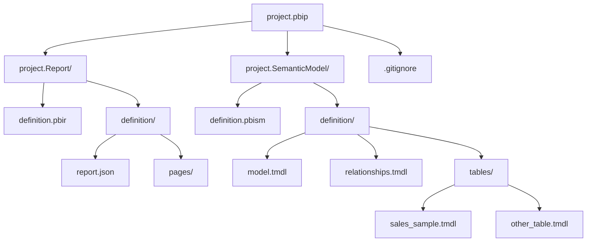

# Exercise 01 — First Contact (Power BI)

**Time:** ~10 minutes  
**Goal:** Get comfortable with Copilot's two core features — inline completions and Copilot Chat — while working with DAX measures in Power BI.

---

## Prerequisites

Install the **TMDL** extension in VS Code before starting these exercises. Search for "TMDL" in the Extensions marketplace (`Ctrl+Shift+X`) and install it. This provides syntax highlighting, IntelliSense, and language support for `.tmdl` files.

---

## What is a PBIP file?

A **Power BI Project (.pbip)** is a folder-based format for Power BI content. Instead of a single binary `.pbix` file, your report and semantic model are stored as human-readable text files — making them ideal for version control and collaboration.

### PBIP Project Structure

### What is a .tmdl file?

**TMDL (Tabular Model Definition Language)** is the text-based format used to define semantic models in Power BI. Each `.tmdl` file describes part of your data model:

- **Table definitions** — columns, data types, source queries
- **Measures** — DAX calculations with formatting and descriptions
- **Relationships** — how tables connect to each other
- **Model metadata** — culture settings, roles, perspectives

The `.tmdl` files live inside the `SemanticModel/definition/` folder. The `tables/` subfolder contains one `.tmdl` file per table — this is where your DAX measures are defined.

### Focus for these exercises

Moving forward, **we will only be working with `.tmdl` files** in these exercises. Each exercise has their own .tmdl files, no .pbip project. 

---

## Background

You've been given a `.tmdl` file ([sales_sample.tmdl](sales_sample.tmdl)) with several incomplete measure definitions in the sales_sample table. Your job is to finish them **using Copilot**, not by writing the DAX yourself.

---

## Steps

### 1. Locate the measures file

In VS Code, open [sales_sample.tmdl](sales_sample.tmdl)

Scroll down to find the "Exercise 01" section with TODO measures. Notice the `/// TODO` comments — those are your targets.

### 2. Use inline completions to complete a measure

Go to the `'Total Quantity'` measure. Delete `BLANK()` and **start typing the DAX yourself** — as you type `SUM(`, Copilot will suggest the rest. Press `Tab` to accept.

> **Tip:** If the suggestion isn't right, press `Esc` and try typing a bit more to give Copilot more context. You can also cycle through alternative suggestions with `Alt+]` (Windows/Linux) or `Option+]` (Mac).

### 3. Let a comment guide Copilot

Find the `'Orders by Region'` measure. Notice the TODO comment includes a hint.

Delete `BLANK()` and just press `Enter` to create a new line — Copilot should suggest the entire implementation based on the comment above. Press `Tab` to accept.

> **Tip:** Copilot reads the surrounding context (comments, measure names, hints) to provide smart suggestions even before you start typing.

### 4. Ask Copilot Chat to complete a measure

Highlight the entire `'Average Order Value'` measure definition (including the comments).

Open Copilot Chat (`Ctrl+Alt+I`) and type:

> "Implement this measure to calculate the average revenue per order."

Review the suggestion, then replace `BLANK()` with the suggested DAX.

### 5. Ask Copilot to explain DAX

Highlight the `'Total Sales'` measure (the existing complete measure at the top) and ask Copilot Chat:

> "Explain what this measure does, step by step."

---

## What to Try

Once the TODOs are done, experiment:

- Ask Copilot Chat: *"What's the difference between SUM and SUMX in DAX?"*
- Uncomment the time intelligence measures and ask Copilot to implement them
- Ask Copilot: *"How would I create a measure that shows revenue for the previous month?"*

---

## Done?

Check your work against [sales_sample_solution.tmdl](sales_sample_solution.tmdl) (which shows the complete table with all measures implemented), then move on to **Exercise 02 →**
